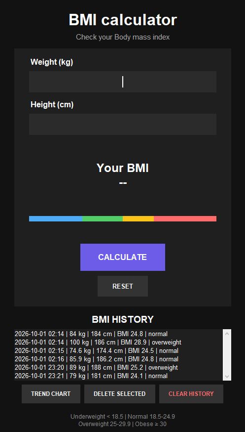
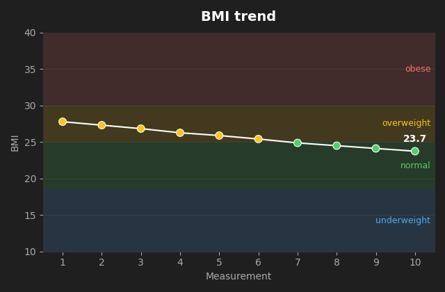

# BMI Calculator

[](https://github.com/Shayanxu/BMI_calculator/actions)

A dark-themed desktop BMI calculator written in Python with tkinter. It keeps a saved history of your results, shows where your BMI sits on a colour scale, and plots your progress over time.

   



*The trend chart, drawn here with sample data.*

## Features

- Calculates BMI from weight (kg) and height (cm); a comma works as a decimal separator (`70,5`)
- Colour-coded result: underweight, normal, overweight, obese
- Colour bar with a marker showing where your BMI falls
- Healthy weight range for the entered height
- History with date and time, saved to `bmi_history.json` and restored on the next launch
- Trend chart of your BMI over time (optional, needs matplotlib)
- Delete a single history entry or clear everything
- Input validation (weight 2-600 kg, height 50-275 cm) and a safe fallback if the history file is corrupt
- Press **Enter** to calculate

## Requirements

- Python 3.9 or newer
- tkinter (included with the standard Python installers for Windows and macOS; on Debian/Ubuntu run `sudo apt install python3-tk`)
- matplotlib, only for the trend chart: `pip install -r requirements.txt`. The app works without it and shows a hint when you press the chart button.

## Run

```bash
python bmi_app.py
```

## Tests

```bash
python -m unittest -v
```

The tests cover the calculation, category limits, input parsing, record formatting, history loading/saving, and chart generation (skipped if matplotlib is not installed).

They also run automatically on Windows, Linux and macOS with Python 3.9, 3.12 and 3.13 through GitHub Actions (`.github/workflows/tests.yml`). The tests check the logic only, not how the window looks on each system.

## Build a standalone executable

```bash
pip install pyinstaller
pyinstaller --onefile --windowed bmi_app.py
```

The result is in the `dist/` folder. Build it on the operating system you want to run it on.

## Project structure

| File | Purpose |
| --- | --- |
| `bmi_core.py` | BMI logic, validation, and history storage. No GUI code. |
| `bmi_chart.py` | Builds the trend chart figure with matplotlib. |
| `bmi_app.py` | The tkinter interface (`BMIApp` class). |
| `test_bmi_core.py`, `test_bmi_chart.py` | Unit tests. |
| `.github/workflows/tests.yml` | Runs the tests automatically on GitHub. |

## Note

BMI is only a rough screening index. It does not account for muscle mass, age, or body composition, and it is not a medical diagnosis.
